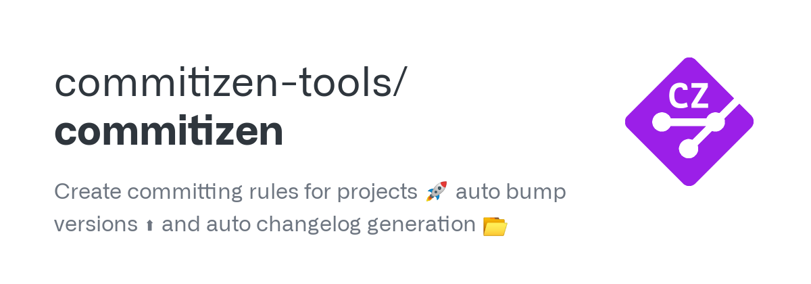

## Commits semanticos by João

<div align="left">
  
  
  
  
</div>


> Commits semânticos são uma prática recomendada para manter um histórico de commits claro e informativo. Eles seguem uma convenção específica que descreve o tipo de mudança feita, o escopo (opcional) e uma descrição breve e concisa..

## ➡️ Conventional Commits

```

<tipo>(<escopo opcional>): <descrição>
<mensagem detalhada opcional>
<informações adicionais, como referências a issues ou PRs>

```

## ➡️ Tipos de Commits

<ul>
  <li><strong>feat</strong>: Introdução de uma nova funcionalidade.</li>
  <li><strong>fix</strong>: Correção de um bug.</li>
  <li><strong>docs</strong>: Alterações na documentação.</li>
  <li><strong>style</strong>: Mudanças que não afetam a lógica do código (espaços em branco, formatação, ponto e vírgula ausente, etc.).</li>
  <li><strong>refactor</strong>: Mudanças no código que não corrigem bugs nem adicionam funcionalidades.</li>
  <li><strong>perf</strong>: Mudanças que melhoram a performance.</li>
  <li><strong>test</strong>: Adição ou correção de testes.</li>
  <li><strong>build</strong>: Mudanças que afetam o sistema de build ou dependências externas (scopes de exemplos: gulp, broccoli, npm).</li>
  <li><strong>ci</strong>: Mudanças em arquivos e scripts de configuração de CI (exemplos de scopes: Travis, Circle, BrowserStack, SauceLabs).</li>
  <li><strong>chore</strong>: Outras mudanças que não modificam src ou arquivos de teste.</li>
  <li><strong>revert</strong>: Reverte um commit anterior.</li>
</ul>

## ➡️ Exemplos

### Feat: Adicionando nova funcionalidade

```
git commit -m "feat(auth): adicionar funcionalidade de recuperação de senha"
```

### Fix: Corrigindo um bug

```
git commit -m "fix(api): corrigir erro de validação no endpoint de login"
```

### Docs: Atualizando a documentação

```
git commit -m "docs(README): adicionar instruções de configuração do projeto"
```

### Style: Ajustando formatação de código

```
git commit -m "style: corrigir formatação do código no arquivo main.js"
```

## 👀 Observe

<strong>Os commits semânticos geralmente são escritos no infinitivo por várias razões:</strong>

<ul>
  <li><strong>Clareza e Consistência</strong>
    <p>Escrever commits no infinitivo ajuda a manter a clareza e a consistência no histórico de commits. Isso torna mais fácil para qualquer pessoa entender a intenção do commit.</p>
  </li>
  <li><strong>Ação Descritiva</strong>
    <p>O infinitivo descreve a ação de maneira direta e clara, o que ajuda a entender exatamente o que o commit faz. Por exemplo, "adicionar funcionalidade de login" é mais claro do que "adiciona funcionalidade de login".</p>
  </li>
  <li><strong>Melhor Legibilidade</strong>
    <p>Mensagens de commit no infinitivo são frequentemente mais legíveis e padronizadas, o que facilita a leitura rápida do histórico de commits.</p>
  </li>
  <li><strong>Padrão de Indústria</strong>
    <p>Seguir convenções como o Conventional Commits e outros padrões da indústria que recomendam o uso do infinitivo ajuda a alinhar-se com práticas comuns adotadas por muitas equipes e projetos.</p>
  </li>
</ul>

## ❌ Exemplos de Mau Uso

<ul>
  <li><code>update files</code> (muito vago)</li>
  <li><code>fix</code> (não especifica o que foi corrigido)</li>
  <li><code>changes made</code> (não informa quais mudanças foram feitas)</li>
  <li><code>.</code> (não fornece nenhuma informação útil)</li>
</ul>

## 📝 Mensagem Detalhada e Informações Adicionais

<p>
Para commits mais complexos, você pode adicionar uma mensagem detalhada e informações adicionais, como referência a issues ou pull requests:</p>

```
git commit -m "feat(auth): adicionar funcionalidade de recuperação de senha

Adiciona a capacidade de os usuários solicitarem a recuperação de senha
através de um email de recuperação. Inclui validação no backend e envio
de emails.
```

## 🛠️ Ferramentas

<p>Existem várias ferramentas que podem ajudar a seguir a convenção de commits semânticos</p>

### Commitizen

<a href="https://github.com/commitizen/cz-cli"></a>

> Clique na imagem para acessar o repositório

```
npm install -g commitizen
```

```
git cz
```

### Husky

<a href="https://typicode.github.io/husky/"></a>

> Clique na imagem para acessar o repositório

<p>Configurar no package.json:</p>

```
"husky": {
  "hooks": {
    "commit-msg": "commitlint -E HUSKY_GIT_PARAMS"
  }
}
```

## 🤓 Me acompanhe para mais


> "Não quero perder a pequena família que me resta. Eu vou vencer, não importa o que aconteça! Eu vou sobreviver, não importa o que aconteça. Só aos vitoriosos é permitido viver"
> ___Mikasa Ackerman___
